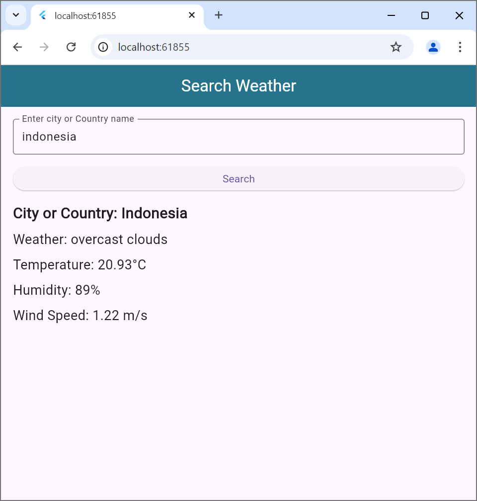
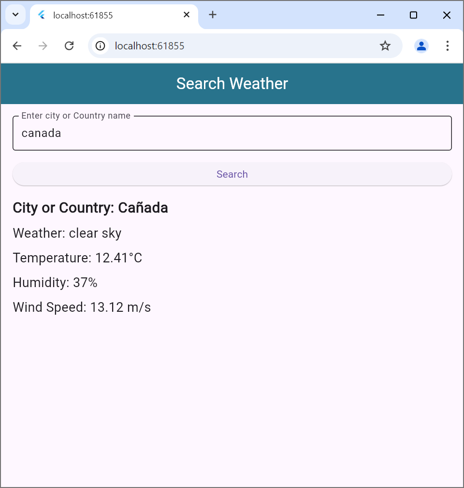
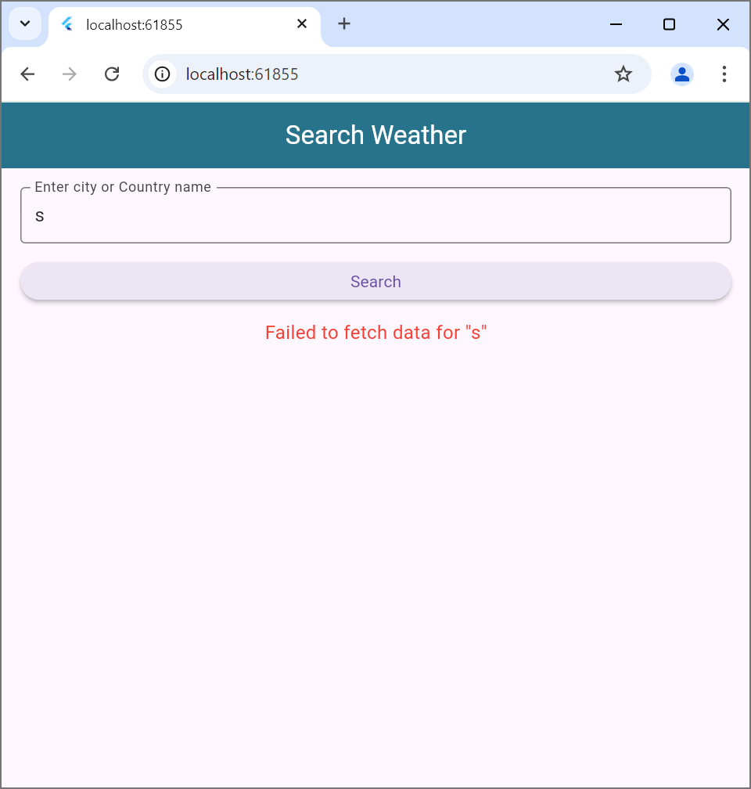
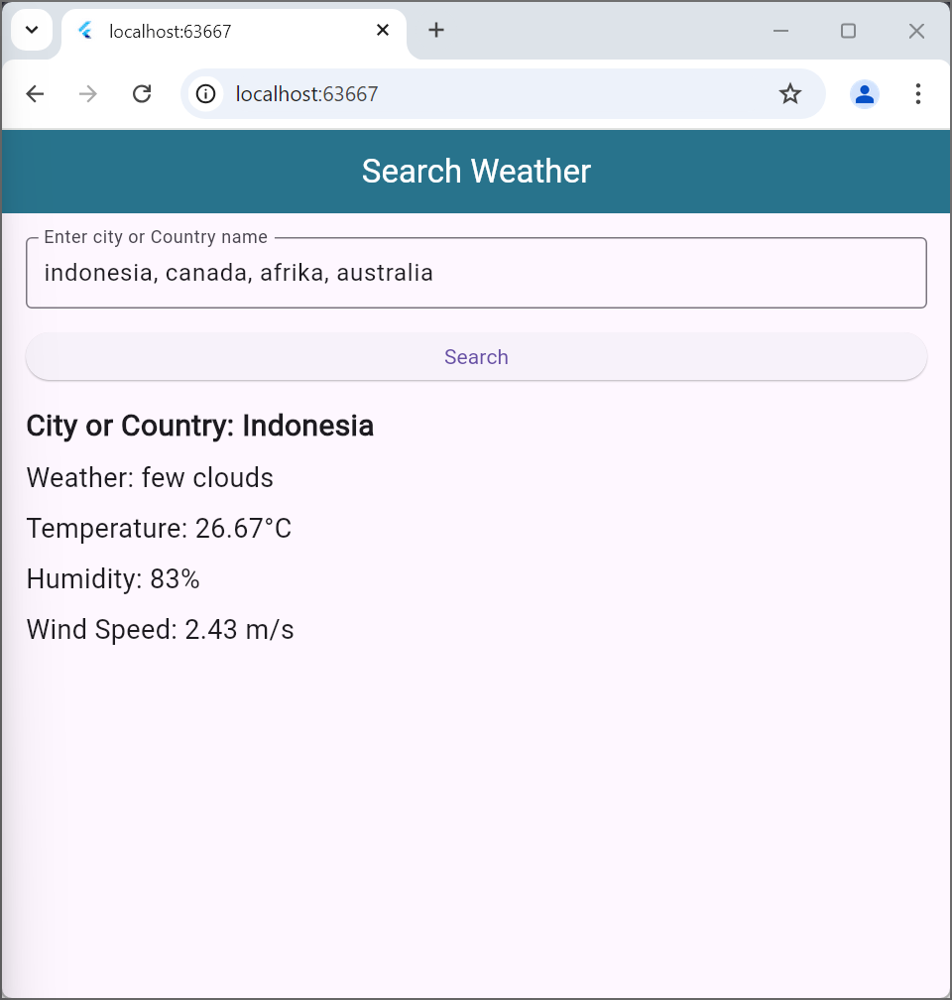

hasil:
~ Search cuaca berdasarkan country atau negara:

~ Search cuaca tidak sesuai, akan muncul pesan kesalahan

~ Search cuaca dengan berbagai negara:

kode tersebut merupakan implementasi api flutter untuk mencari informasi cuaca dari API OpenWeather berdasarkan nama kota ataupun negara. Di dalam file ApiService yang merupakan api untuk cuaca, menggunakan package http untuk mengambil data cuaca dari API OpenWeather, Jika berhasil respons(kode 200) data akan dikembalikan dalam bentuk json, dan jika gagal akan muncul pesan kesalahan seperti pada image3. Di file main.dart terdapat myApp yaitu widget utama yang berfungsi untuk menjalankan dan menampilkan halaman pencarian cuaca. Sedangkan di dalam class SearchWeatherPage memiliki textfield untuk memasukkan nama kota ataupun negara, memiliki tombol search untuk mencari data cuaca, dan jika data berhasil ditemukan akan memunculkan informasi cuaca seperti nama kota, kondisi cuaca, suhu, kelembapan dan kecepatan angin.